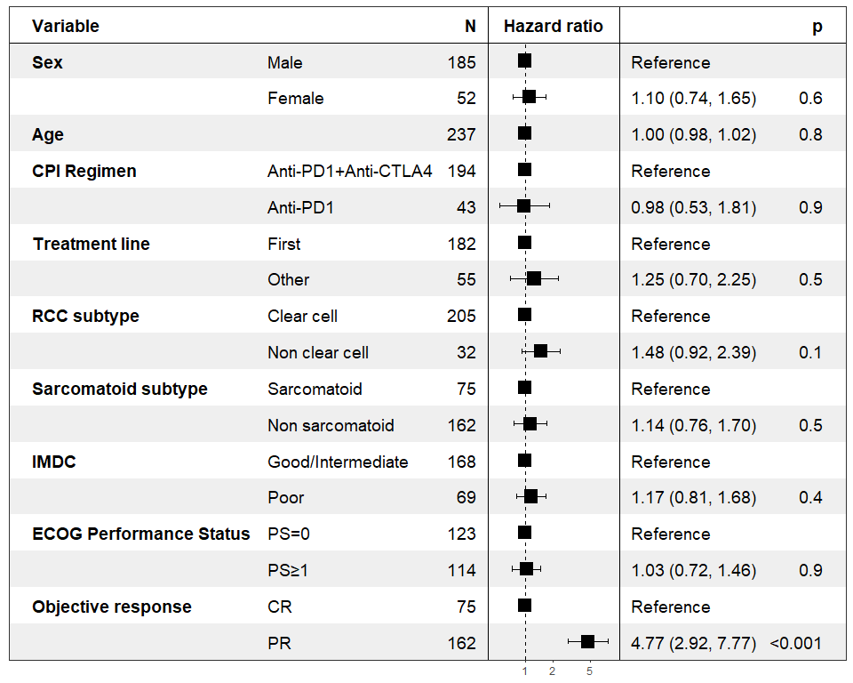
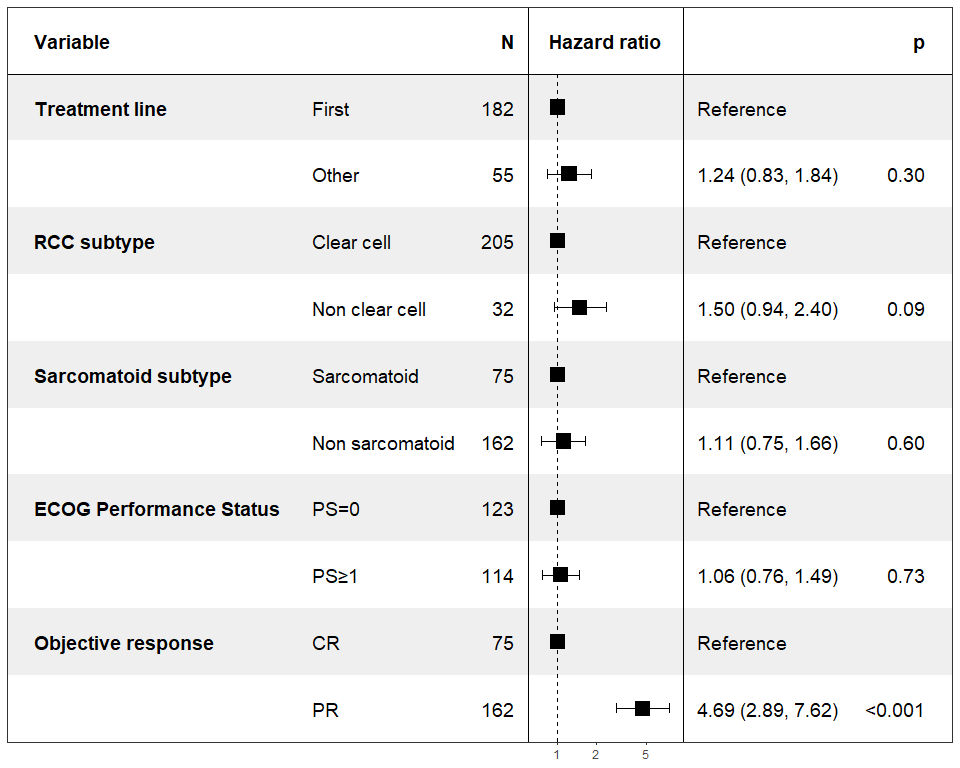

Survival analysis renal
================
Mario Presti
First created on Feb 2025. Updated on 25 November 2025

- [Introduction](#introduction)
- [Loading Libraries](#loading-libraries)
  - [Pre-processing of data](#pre-processing-of-data)
- [OS analysis](#os-analysis)
  - [Multivariate Survival Analysis - only complete
    cases](#multivariate-survival-analysis---only-complete-cases)
- [Combined Univariable vs Multivariable Forest Plots -
  OS](#combined-univariable-vs-multivariable-forest-plots---os)
- [PFS analysis](#pfs-analysis)
  - [Multiple Univariate analysis - Incomplete complete
    cases](#multiple-univariate-analysis---incomplete-complete-cases)
- [Multivariate Survival Analysis](#multivariate-survival-analysis)
  - [All responders - PFS](#all-responders---pfs)
- [Combined Univariable vs Multivariable Forest Plots -
  PFS](#combined-univariable-vs-multivariable-forest-plots---pfs)
- [RSS analysis](#rss-analysis)
  - [Multivariate Survival Analysis - only complete
    cases](#multivariate-survival-analysis---only-complete-cases-1)
- [Combined Univariable vs Multivariable Forest Plots -
  RSS](#combined-univariable-vs-multivariable-forest-plots---rss)
- [Five-Year Survival Estimates by
  Response](#five-year-survival-estimates-by-response)

# Introduction

Multivariate Survival Analysis on the Renal database.

# Loading Libraries

``` r
# Load required libraries
library(pacman)
pacman::p_load(data.table,stringr,tidyverse,ggplot2,MatchIt,survival,survminer,survey,compareGroups, forestmodel, forestplot, openxlsx,kableExtra,ggsurvfit,extrafont,DT,tibble,strex,hrbrthemes,ggstatsplot,reshape,pander,ggrepel,scales,dataMaid,gridExtra,tidytidbits,survivalAnalysis,gtsummary, Cairo,Amelia,officer,mice,naniar)
```

## Pre-processing of data

- Check that all columns have no spaces etc, especially character
  columns,
- transform character columns to factors.
- Check if all factors are ok.
- Check numerical columns.

We first need to define which columns we want as character
(categorical), and which need to be numerical. Sometimes things get
messed up with excel files.

``` r
setwd("E:/PhD_projects/Realworld/Data/")
dataDF <- read.xlsx("renal_md_agecorrect_DSS.xlsx")

# Check for duplicates
any(duplicated(dataDF$patient_id))
```

    ## [1] FALSE

``` r
# Remove duplicates
dataDF <- dataDF[!duplicated(dataDF), ]
dim(dataDF)
```

    ## [1] 261  50

``` r
# Rename some columns
names(dataDF)[names(dataDF) == 'progression_Marco'] <- 'Progressed'
names(dataDF)[names(dataDF) == 'age'] <- 'age_1st_treat'
names(dataDF)[names(dataDF) == 'Treatment_line'] <- 'line_correct'
names(dataDF)[names(dataDF) == 'Treatment'] <- 'regime_correct'
names(dataDF)[names(dataDF) == 'CNS_mets'] <- 'Brain_metastases'
names(dataDF)[names(dataDF) == 'BOR'] <- 'bor'
names(dataDF)[names(dataDF) == 'ecog_ps.1'] <- 'PS'

# Define the features of interest
features <- c("sex", "age_1st_treat","line_correct", "regime_correct", 
              "Brain_metastases","PS", "bor")

features_cancer_spec <- c("clear_cell","sarcomatoid", "smoking", "IMDC")

## Define which columns include survival data
OS_time <- c("OS_days")
OS_status <- c("Dead")
PFS_time <- c("PFS_days")
PFS_status <- c("Progressed")
RCC_status <- "Dead_RCC"

## DEFINE WHICH COLUMNS ARE CATEGORICAL
categ_feats <-c("sex","regime_correct","PS", "bor", "line_correct",features_cancer_spec)

## DEFINE WHICH COLUMNS ARE NUMERICAL
numeric_feats <- c("OS_days", "Dead","PFS_days","Progressed","Dead_RCC","age_1st_treat")

# Remove spaces from column names and features.
colnames(dataDF) <- gsub(" ","_",colnames(dataDF))
features <- gsub(" ","_",features)
categ_feats <- gsub(" ","_",categ_feats)
numeric_feats <- gsub(" ","_",numeric_feats)
OS_time <- gsub(" ","_",OS_time)
OS_status <- gsub(" ","_",OS_status)
PFS_time <- gsub(" ","_",PFS_time)
PFS_status <- gsub(" ","_",PFS_status)

## MAKE SURE THERE ARE NO BLANKS ANYWHERE IN THE DATA
## Find non-Numeric columns
num_cols <- sapply(dataDF, is.numeric)

dataDF <- cbind(apply(dataDF[,!num_cols], 2, str_remove_all, "NA"),dataDF[,num_cols])   # Remove blanks

### MAKE SURE THAT THE COLUMNS ARE IN THE CORRECT FORMAT NEEDED FOR ANALYSIS.
## Numeric columns
dataDF <- dataDF %>% mutate(across(all_of(numeric_feats), as.numeric))

## Categorical
dataDF <- dataDF %>% mutate(across(all_of(categ_feats), as.character))

# Transform character columns to categorical, to have the different levels
dataDF <- dataDF %>% dplyr::mutate(across(all_of(categ_feats), as.factor))
dataDF <- dataDF %>% dplyr::select(all_of(c(colnames(dataDF)[1], OS_time,OS_status,RCC_status, PFS_time,PFS_status, features, features_cancer_spec))) %>% distinct()


print("Numbers per treatment")
```

    ## [1] "Numbers per treatment"

``` r
table(dataDF$regime_correct)
```

    ## 
    ##  ipi/nivo nivolumab 
    ##       200        61

``` r
print("Numbers per response")
```

    ## [1] "Numbers per response"

``` r
table(dataDF$bor)
```

    ## 
    ##  CR  PR 
    ##  79 182

``` r
## SUMMARY OF THE DATA
summary(dataDF)
```

    ##   record_id            OS_days          Dead           Dead_RCC     
    ##  Length:261         Min.   : 164   Min.   :0.0000   Min.   :0.0000  
    ##  Class :character   1st Qu.:1021   1st Qu.:0.0000   1st Qu.:0.0000  
    ##  Mode  :character   Median :1370   Median :0.0000   Median :0.0000  
    ##                     Mean   :1372   Mean   :0.3333   Mean   :0.3027  
    ##                     3rd Qu.:1770   3rd Qu.:1.0000   3rd Qu.:1.0000  
    ##                     Max.   :3313   Max.   :1.0000   Max.   :1.0000  
    ##     PFS_days        Progressed       sex      age_1st_treat   line_correct
    ##  Min.   :  60.0   Min.   :0.0000   1   :200   Min.   :27.42   First:189   
    ##  1st Qu.: 384.0   1st Qu.:0.0000   2   : 59   1st Qu.:58.41   Other: 72   
    ##  Median : 918.0   Median :1.0000   NA's:  2   Median :65.43               
    ##  Mean   : 953.8   Mean   :0.6054              Mean   :64.78               
    ##  3rd Qu.:1412.0   3rd Qu.:1.0000              3rd Qu.:72.32               
    ##  Max.   :2756.0   Max.   :1.0000              Max.   :85.89               
    ##    regime_correct Brain_metastases      PS      bor      clear_cell sarcomatoid
    ##  ipi/nivo :200    Length:261         0   :128   CR: 79   ja :225    ja : 79    
    ##  nivolumab: 61    Class :character   1   :111   PR:182   nej: 36    nej:182    
    ##                   Mode  :character   2   : 18                                  
    ##                                      3   :  1                                  
    ##                                      NA's:  3                                  
    ##                                                                                
    ##  smoking                   IMDC    
    ##  0   : 74   Good/Intermediate:187  
    ##  1   : 39   Poor             : 74  
    ##  2   :125                          
    ##  99  :  5                          
    ##  NA's: 18                          
    ## 

``` r
# remove some white spaces in the PS column
dataDF$PS <- trimws(dataDF$PS)
dataDF$PS <- as.factor(dataDF$PS)

# Rename some factors for plots
dataDF <- dataDF %>%
  dplyr::mutate(
    Sex = case_when(
      sex == "2"   ~ "Female",
      sex == "1"   ~ "Male",
      sex == "99"  ~ NA_character_,
      TRUE         ~ NA_character_
    ),
    Sex = factor(Sex, levels = c("Male", "Female")),

    regime_correct = case_when(
      regime_correct == "nivolumab" ~ "Anti-PD1",
      regime_correct == "ipi/nivo"  ~ "Ipi+Nivo",
      regime_correct == "99"        ~ NA_character_,
      TRUE                           ~ NA_character_
    ),
    regime_correct = factor(
      regime_correct,
      levels = c("Anti-PD1", "Ipi+Nivo")
    ),

    PS = case_when(
      PS %in% c("1", "2", "3") ~ "PS≥1",
      PS == "0"               ~ "PS=0",
      PS == "99"              ~ NA_character_,
      TRUE                    ~ NA_character_
    ),
    PS = factor(PS, levels = c("PS=0", "PS≥1")),
    
    regime_correct = case_when(
      regime_correct == "Ipi+Nivo" ~ "Anti-PD1+Anti-CTLA4",
      regime_correct == "Anti-PD1" ~ "Anti-PD1",
      regime_correct == "99"       ~ NA_character_,
      TRUE                    ~ NA_character_
    ),
    regime_correct = factor(regime_correct, levels = c("Anti-PD1", "Anti-PD1+Anti-CTLA4")),

    smoking = case_when(
      smoking == "0"           ~ "Non smoker",
      smoking == "1" ~ "Current smoker",
      smoking == "2" ~ "Former smoker",
      smoking == "99"          ~ NA_character_,
      TRUE                     ~ NA_character_
    ),
    smoking = factor(
      smoking,
      levels = c("Non smoker", "Current smoker","Former smoker")
    ),
    
    Brain_metastases = case_when(
     Brain_metastases == "No"           ~ "No",
     Brain_metastases == "Yes" ~ "Yes",
      TRUE                     ~ NA_character_
    ),
    Brain_metastases = factor(
      Brain_metastases,
      levels = c("No", "Yes")
    ),

    clear_cell = case_when(
      clear_cell == "ja"   ~ "Clear cell",
      clear_cell == "nej"  ~ "Non clear cell",
      clear_cell == "99"   ~ NA_character_,
      TRUE                  ~ NA_character_
    ),
    clear_cell = factor(
      clear_cell,
      levels = c("Clear cell", "Non clear cell")
    ),
    sarcomatoid = case_when(
      sarcomatoid == "ja"   ~ "Sarcomatoid",
      sarcomatoid == "nej"  ~ "Non sarcomatoid",
      sarcomatoid == "99"   ~ NA_character_,
      TRUE                  ~ NA_character_
    ),
    sarcomatoid = factor(
      sarcomatoid,
      levels = c("Sarcomatoid", "Non sarcomatoid")
    ),
    IMDC = case_when(
      IMDC == "Poor"   ~ "Poor",
      IMDC == "Good/Intermediate"  ~ "Good/Intermediate",
      IMDC == "99"   ~ NA_character_,
      TRUE                  ~ NA_character_
    ),
    IMDC = factor(
      IMDC,
      levels = c("Poor", "Good/Intermediate")
    )
  )

#remove some useless columns
dataDF$sex <- NULL

# rename some of the columns for plotting
names(dataDF)[names(dataDF) == 'age_1st_treat'] <- 'Age'
names(dataDF)[names(dataDF) == 'regime_correct'] <- 'CPI Regimen'
names(dataDF)[names(dataDF) == 'PS'] <- 'ECOG Performance Status'
names(dataDF)[names(dataDF) == 'Brain_metastases'] <- 'Brain metastases'
names(dataDF)[names(dataDF) == 'bor'] <- 'Objective response'
names(dataDF)[names(dataDF) == 'line_correct'] <- 'Treatment line'
names(dataDF)[names(dataDF) == 'clear_cell'] <- 'RCC subtype'
names(dataDF)[names(dataDF) == 'sarcomatoid'] <- 'Sarcomatoid subtype'
names(dataDF)[names(dataDF) == 'smoking'] <- 'Smoking status'
features <- c("Sex", "Age", "CPI Regimen", "Treatment line", "RCC subtype", "Sarcomatoid subtype","IMDC","ECOG Performance Status", "Objective response")

write.csv(dataDF, file = "RCC_data_polished.csv", sep = ",", append = F, row.names = F)

#Administrative censoring at 60 months
dataDF$censor_time_OS   <- pmin(dataDF$OS_days/30, 60)
dataDF$censor_status_OS <- ifelse(dataDF$OS_days/30 > 60, 0, dataDF$Dead)
#Administrative censoring at 60 months
dataDF$censor_time_PFS   <- pmin(dataDF$PFS_days/30, 60)
dataDF$censor_status_PFS <- ifelse(dataDF$PFS_days/30 > 60, 0, dataDF$Progressed)
#Administrative censoring at 60 months
dataDF$censor_status_RSS <- ifelse(dataDF$OS_days/30 > 60, 0, dataDF$Dead_RCC)
```

``` r
descr_features <- paste0("`", c(features, "CPI Regimen"), "`", collapse = " + ")
descr_formula <- as.formula(paste0("~", descr_features))

Baseline_Characteristics_table_Partial_patients <- descrTable(descr_formula , data = dataDF)
```

# OS analysis

\##Multiple Univariate analysis - Including missing data

``` r
surv_time <- "censor_time_OS"
surv_status <- "censor_status_OS"
surv_time_label <- "OS"
# Find the best reference for each feature
best_refs <- character(length(features))
names(best_refs) <- features

for (i in seq_along(features)) {
  var <- features[i]

  # Skip this iteration if this column isn't a factor
  if (! is.factor(dataDF[[var]])) {
    next
  }

  vals <- na.omit(unique(dataDF[[var]]))
  # ensure factor
  vals <- as.character(vals)

  # storage for max HR per candidate ref
  hr_max <- numeric(length(vals))

  for (j in seq_along(vals)) {
    ref_level <- vals[j]
    df2 <- dataDF
    if(!"ordered" %in% class(df2[[var]])){
      df2[[var]] <- relevel(as.factor(df2[[var]]), ref = ref_level)
    }

    uni <- analyse_survival(
      df2,
      time_status = c(surv_time, surv_status),
      by          = .data[[var]]
    )

    fit   <- uni$coxph    # the coxph object
    coefs <- coef(fit)    # log HRs
    hrs   <- exp(coefs)   # HRs
    hr_max[j] <- if (length(hrs) > 0) max(hrs, na.rm = TRUE) else NA
  }

  # pick the ref that yielded the largest HR
  best_refs[var] <- vals[which.max(hr_max)]
}

# Re‐level dataDF based on those best refs
for (var in features) {
  if (! is.factor(dataDF[[var]])) {
    next
  }
  if(!"ordered" %in% class(dataDF[[var]])){
    dataDF[[var]] <- relevel(
    as.factor(dataDF[[var]]),
    ref = best_refs[var]
  )
  }
}

multiple_uni <- map(features, function(by){analyse_multivariate(dataDF,
                       c(surv_time,surv_status),
                       covariates = list(by), # covariates expects a list
                       covariate_name_dict = NULL,
                       covariate_label_dict = NULL)})
```

    ## Warning: There was 1 warning in `mutate()`.
    ## ℹ In argument: `factor.name = map_chr(coefficient_labels, symbol_substring,
    ##   call_symbols)`.
    ## Caused by warning:
    ## ! `as_logical()` is deprecated as of rlang 0.4.0
    ## Please use `vctrs::vec_cast()` instead.
    ## This warning is displayed once every 8 hours.

``` r
max_cis <- max(sapply(
  multiple_uni,
  function(x) max(x$summary$conf.int, na.rm = TRUE))
)
min_cis <- min(sapply(
  multiple_uni,
  function(x) min(x$summary$conf.int, na.rm = TRUE))
)

HR_x_limits <- c(min_cis, max_cis) * c(1/1.5, 1.5)
HR_x_breaks <- round(10^pretty(log10(HR_x_limits), n = 7),digits = 1)

forest_plot(multiple_uni,
            #factor_labeller = covariate_names,
            endpoint_labeller = c(time=surv_time_label),
            # orderer = ~order(HR),
            labels_displayed = c("factor"),#"endpoint",
            ggtheme = ggplot2::theme_bw(base_size = 10),
            #values_displayed = c("HR","CI","p"),
            HR_x_limits = c(min_cis*1.5,max_cis*1.5),
            HR_x_breaks = c(1,2,ceiling(10^pretty(log10(HR_x_limits), n = 7)*2/2))
            #p_lessthan_cutoff = 0.05
            )
```

    ## Warning: `as_list()` is deprecated as of rlang 0.4.0
    ## Please use `vctrs::vec_cast()` instead.
    ## This warning is displayed once every 8 hours.

    ## Warning: `switch_type()` is soft-deprecated as of rlang 0.4.0.
    ## Please use `switch(typeof())` or `switch(my_typeof())` instead.
    ## This warning is displayed once every 8 hours.

    ## `height` was translated to `width`.

<!-- -->

``` r
#save this for the comparison at the end with the 18 month landmark

hr_OS_resp <-multiple_uni[[length(multiple_uni)]]$coxph
```

## Multivariate Survival Analysis - only complete cases

``` r
# # To remove both (NAs and empty):
dataDF_complete <- dataDF %>%
  drop_na() %>%  # Remove NA values
  filter_all(all_vars(. != "")) %>%  # Remove empty strings
  filter_all(all_vars(trimws(.) != ""))  # Remove strings with only spaces

dim(dataDF_complete)
```

    ## [1] 237  22

``` r
multiv_feats_sign <- c()
for (i in seq_along(features)){
  coef <- as.data.frame(multiple_uni[[i]]$summary$coefficients)
  if(nrow(coef) >1){
    pval <- min(coef$`Pr(>|z|)`)
  } else {
  pval <- coef$`Pr(>|z|)`
  }
  if(any(pval < 0.2)){
    multiv_feats_sign <- c(multiv_feats_sign, multiple_uni[[i]]$overall$covariates)
  }
}

multiv_feats_sign_formula <- paste0("`", multiv_feats_sign, "`", collapse = " + ")
fmla_sign <- as.formula(paste0(
  "Surv(dataDF_complete[[surv_time]], dataDF_complete[[surv_status]]) ~ ",
  multiv_feats_sign_formula
))

multiv_feats_all<- paste0("`", features, "`", collapse = " + ")
fmla_all <- as.formula(paste0(
  "Surv(dataDF_complete[[surv_time]], dataDF_complete[[surv_status]]) ~ ",
  multiv_feats_all
))

cox_model_all <- coxph(fmla_all, data = dataDF_complete)
cox_model_sign <- coxph(fmla_sign, data = dataDF_complete)

summary(cox_model_all)
```

    ## Call:
    ## coxph(formula = fmla_all, data = dataDF_complete)
    ## 
    ##   n= 237, number of events= 70 
    ## 
    ##                                          coef exp(coef) se(coef)      z
    ## SexFemale                             0.55133   1.73556  0.27453  2.008
    ## Age                                   0.02313   1.02340  0.01416  1.634
    ## `CPI Regimen`Anti-PD1                 0.69239   1.99849  0.43055  1.608
    ## `Treatment line`Other                -0.31918   0.72674  0.43280 -0.737
    ## `RCC subtype`Non clear cell           0.72712   2.06912  0.33625  2.162
    ## `Sarcomatoid subtype`Non sarcomatoid  0.08025   1.08355  0.30378  0.264
    ## IMDCPoor                              0.81421   2.25740  0.25115  3.242
    ## `ECOG Performance Status`PS≥1         0.15767   1.17078  0.26291  0.600
    ## `Objective response`PR                2.61213  13.62807  0.59742  4.372
    ##                                      Pr(>|z|)    
    ## SexFemale                             0.04461 *  
    ## Age                                   0.10223    
    ## `CPI Regimen`Anti-PD1                 0.10780    
    ## `Treatment line`Other                 0.46083    
    ## `RCC subtype`Non clear cell           0.03058 *  
    ## `Sarcomatoid subtype`Non sarcomatoid  0.79166    
    ## IMDCPoor                              0.00119 ** 
    ## `ECOG Performance Status`PS≥1         0.54870    
    ## `Objective response`PR               1.23e-05 ***
    ## ---
    ## Signif. codes:  0 '***' 0.001 '**' 0.01 '*' 0.05 '.' 0.1 ' ' 1
    ## 
    ##                                      exp(coef) exp(-coef) lower .95 upper .95
    ## SexFemale                               1.7356    0.57618    1.0134     2.972
    ## Age                                     1.0234    0.97713    0.9954     1.052
    ## `CPI Regimen`Anti-PD1                   1.9985    0.50038    0.8595     4.647
    ## `Treatment line`Other                   0.7267    1.37600    0.3112     1.697
    ## `RCC subtype`Non clear cell             2.0691    0.48330    1.0705     3.999
    ## `Sarcomatoid subtype`Non sarcomatoid    1.0836    0.92289    0.5974     1.965
    ## IMDCPoor                                2.2574    0.44299    1.3798     3.693
    ## `ECOG Performance Status`PS≥1           1.1708    0.85413    0.6993     1.960
    ## `Objective response`PR                 13.6281    0.07338    4.2258    43.950
    ## 
    ## Concordance= 0.779  (se = 0.026 )
    ## Likelihood ratio test= 73.56  on 9 df,   p=3e-12
    ## Wald test            = 50.35  on 9 df,   p=9e-08
    ## Score (logrank) test = 66.55  on 9 df,   p=7e-11

``` r
summary(cox_model_sign)
```

    ## Call:
    ## coxph(formula = fmla_sign, data = dataDF_complete)
    ## 
    ##   n= 237, number of events= 70 
    ## 
    ##                                          coef exp(coef) se(coef)      z
    ## SexFemale                             0.55133   1.73556  0.27453  2.008
    ## Age                                   0.02313   1.02340  0.01416  1.634
    ## `CPI Regimen`Anti-PD1                 0.69239   1.99849  0.43055  1.608
    ## `Treatment line`Other                -0.31918   0.72674  0.43280 -0.737
    ## `RCC subtype`Non clear cell           0.72712   2.06912  0.33625  2.162
    ## `Sarcomatoid subtype`Non sarcomatoid  0.08025   1.08355  0.30378  0.264
    ## IMDCPoor                              0.81421   2.25740  0.25115  3.242
    ## `ECOG Performance Status`PS≥1         0.15767   1.17078  0.26291  0.600
    ## `Objective response`PR                2.61213  13.62807  0.59742  4.372
    ##                                      Pr(>|z|)    
    ## SexFemale                             0.04461 *  
    ## Age                                   0.10223    
    ## `CPI Regimen`Anti-PD1                 0.10780    
    ## `Treatment line`Other                 0.46083    
    ## `RCC subtype`Non clear cell           0.03058 *  
    ## `Sarcomatoid subtype`Non sarcomatoid  0.79166    
    ## IMDCPoor                              0.00119 ** 
    ## `ECOG Performance Status`PS≥1         0.54870    
    ## `Objective response`PR               1.23e-05 ***
    ## ---
    ## Signif. codes:  0 '***' 0.001 '**' 0.01 '*' 0.05 '.' 0.1 ' ' 1
    ## 
    ##                                      exp(coef) exp(-coef) lower .95 upper .95
    ## SexFemale                               1.7356    0.57618    1.0134     2.972
    ## Age                                     1.0234    0.97713    0.9954     1.052
    ## `CPI Regimen`Anti-PD1                   1.9985    0.50038    0.8595     4.647
    ## `Treatment line`Other                   0.7267    1.37600    0.3112     1.697
    ## `RCC subtype`Non clear cell             2.0691    0.48330    1.0705     3.999
    ## `Sarcomatoid subtype`Non sarcomatoid    1.0836    0.92289    0.5974     1.965
    ## IMDCPoor                                2.2574    0.44299    1.3798     3.693
    ## `ECOG Performance Status`PS≥1           1.1708    0.85413    0.6993     1.960
    ## `Objective response`PR                 13.6281    0.07338    4.2258    43.950
    ## 
    ## Concordance= 0.779  (se = 0.026 )
    ## Likelihood ratio test= 73.56  on 9 df,   p=3e-12
    ## Wald test            = 50.35  on 9 df,   p=9e-08
    ## Score (logrank) test = 66.55  on 9 df,   p=7e-11

``` r
forest_model_all <- forest_model(cox_model_all,  # Set x-axis limits
                             exponentiate = TRUE)  # Display hazard ratios on log scale)
forest_model_sign <- forest_model(cox_model_sign,  # Set x-axis limits
                             exponentiate = TRUE)  # Display hazard ratios on log scale)

# Display the plot
print(forest_model_all)
```

<!-- -->

``` r
print(forest_model_sign)
```

<!-- -->

# Combined Univariable vs Multivariable Forest Plots - OS

``` r
# Prepare empty list to collect rows
rows <- vector("list", 0)

# Summaries of the multivariable model
s_multi    <- summary(cox_model_sign)
coef_multi <- s_multi$coefficients      # matrix with exp(coef) and p
ci_multi   <- s_multi$conf.int          # matrix with lower/upper .95

# Loop over each univariable result
for (i in seq_along(multiple_uni)) {
  u    <- multiple_uni[[i]]
  cov  <- u$overall$covariates           # the covariate name
  fit  <- u$coxph
  s_u  <- summary(fit)
  coef_u <- s_u$coefficients             # matrix with exp(coef) etc.
  ci_u   <- s_u$conf.int
  if(u$summaryAsFrame$factor.value[1] == "<continuous>"){
    reference <- "NA"
    levs <- "Fitted as continuous"
  } else {
    reference <- levels(as.factor(u$data[,ncol(u$data)]))[1]
    levs <- setdiff(unique(u$data[,ncol(u$data)]), reference)
  }
  # for each row (level) in the univariable fit:
  for (j in seq_len(nrow(coef_u))) {
    HRu  <- coef_u[j, "exp(coef)"]
    LUu  <- ci_u[j,   "lower .95"]
    UCu  <- ci_u[j,   "upper .95"]
    pu   <- coef_u[j, "Pr(>|z|)"]
    
    if (cov %in% multiv_feats_sign) {
      HRm <- coef_multi[grep(cov, rownames(coef_multi))[j], "exp(coef)"]
      LUm <- ci_multi[ grep(cov, rownames(coef_multi))[j], "lower .95"]
      UCm <- ci_multi[ grep(cov, rownames(coef_multi))[j], "upper .95"]
      pm  <- coef_multi[grep(cov, rownames(coef_multi))[j], "Pr(>|z|)"]
    } else {
      HRm <- NA; LUm <- NA; UCm <- NA; pm <- NA
    }
    
    rows[[length(rows) + 1]] <- data.frame(
      Covariate       = cov,
      Level           = levs[j],
      Reference       = reference,
      HR_uni          = HRu,
      CI_lo_uni       = LUu,
      CI_hi_uni       = UCu,
      p_uni           = pu,
      HR_multi        = HRm,
      CI_lo_multi     = LUm,
      CI_hi_multi     = UCm,
      p_multi         = pm,
      stringsAsFactors = FALSE
    )
  }
}

# Bind into one data.frame
results_df <- do.call(rbind, rows)

# Format up to three digits
results_df <- results_df %>%
  mutate(across(starts_with("HR_") | starts_with("CI_") | matches("^p_"),
                ~ signif(.x, 3)))

results_df$CI_lo_uni <- paste0(results_df$CI_lo_uni, "-", results_df$CI_hi_uni)
results_df$CI_hi_uni <- NULL
results_df$CI_lo_multi <- paste0(results_df$CI_lo_multi, "-", results_df$CI_hi_multi)
results_df$CI_hi_multi <- NULL
colnames(results_df) <- c("Covariate", "Level", "Reference" , "Univariable HR", "Univariable CI", "Univariable P-value", "Multivariable HR", "Multivariable CI", "Multivariable P-value")

last_col <- ncol(results_df)
results_df <- results_df %>%
  mutate(across(
    .cols = -last_col,
    .fns  = ~ ifelse(is.na(.) | grepl("NA", ., fixed = TRUE), "", .)
  )) %>%
  mutate(across(
    .cols = last_col,
    .fns  = ~ ifelse(is.na(.), "Excluded from multivariable analysis", as.character(.))
  ))

results_df <- results_df %>%
  group_by(Covariate) %>%
  mutate(Covariate = ifelse(row_number() == 1, Covariate, "")) %>%
  ungroup()

n_cols <- ncol(results_df)

# align: left for first two, center for the rest
aligns <- c("l", "l", rep("c", n_cols - 2))

results_df %>%
  kable(
    format = "html",
    caption = "Univariable vs Multivariable Cox Results - OS",
    align   = aligns,
    escape  = FALSE
  ) %>%
  kable_styling(
    bootstrap_options = c("striped", "hover", "condensed"),
    full_width        = FALSE
  ) %>%
  # make header row bold and centered
  row_spec(
    0,
    bold  = TRUE,
    align = "center"
  ) %>%
  # add vertical lines right of col 3 and col 6
  column_spec(3, border_right = TRUE) %>%
  column_spec(6, border_right = TRUE)
```

<table class="table table-striped table-hover table-condensed" style="width: auto !important; margin-left: auto; margin-right: auto;">

<caption>

Univariable vs Multivariable Cox Results - OS
</caption>

<thead>

<tr>

<th style="text-align:left;font-weight: bold;text-align: center;">

Covariate
</th>

<th style="text-align:left;font-weight: bold;text-align: center;">

Level
</th>

<th style="text-align:center;font-weight: bold;text-align: center;">

Reference
</th>

<th style="text-align:center;font-weight: bold;text-align: center;">

Univariable HR
</th>

<th style="text-align:center;font-weight: bold;text-align: center;">

Univariable CI
</th>

<th style="text-align:center;font-weight: bold;text-align: center;">

Univariable P-value
</th>

<th style="text-align:center;font-weight: bold;text-align: center;">

Multivariable HR
</th>

<th style="text-align:center;font-weight: bold;text-align: center;">

Multivariable CI
</th>

<th style="text-align:center;font-weight: bold;text-align: center;">

Multivariable P-value
</th>

</tr>

</thead>

<tbody>

<tr>

<td style="text-align:left;">

Sex
</td>

<td style="text-align:left;">

Female
</td>

<td style="text-align:center;border-right:1px solid;">

Male
</td>

<td style="text-align:center;">

1.86
</td>

<td style="text-align:center;">

1.16-2.97
</td>

<td style="text-align:center;border-right:1px solid;">

1.01e-02
</td>

<td style="text-align:center;">

1.740
</td>

<td style="text-align:center;">

1.01-2.97
</td>

<td style="text-align:center;">

0.0446
</td>

</tr>

<tr>

<td style="text-align:left;">

Age
</td>

<td style="text-align:left;">

Fitted as continuous
</td>

<td style="text-align:center;border-right:1px solid;">

</td>

<td style="text-align:center;">

1.03
</td>

<td style="text-align:center;">

1.01-1.06
</td>

<td style="text-align:center;border-right:1px solid;">

1.74e-02
</td>

<td style="text-align:center;">

1.020
</td>

<td style="text-align:center;">

0.995-1.05
</td>

<td style="text-align:center;">

0.102
</td>

</tr>

<tr>

<td style="text-align:left;">

CPI Regimen
</td>

<td style="text-align:left;">

Anti-PD1
</td>

<td style="text-align:center;border-right:1px solid;">

Anti-PD1+Anti-CTLA4
</td>

<td style="text-align:center;">

1.65
</td>

<td style="text-align:center;">

1.02-2.65
</td>

<td style="text-align:center;border-right:1px solid;">

4.04e-02
</td>

<td style="text-align:center;">

2.000
</td>

<td style="text-align:center;">

0.859-4.65
</td>

<td style="text-align:center;">

0.108
</td>

</tr>

<tr>

<td style="text-align:left;">

Treatment line
</td>

<td style="text-align:left;">

Other
</td>

<td style="text-align:center;border-right:1px solid;">

First
</td>

<td style="text-align:center;">

1.47
</td>

<td style="text-align:center;">

0.919-2.34
</td>

<td style="text-align:center;border-right:1px solid;">

1.09e-01
</td>

<td style="text-align:center;">

0.727
</td>

<td style="text-align:center;">

0.311-1.7
</td>

<td style="text-align:center;">

0.461
</td>

</tr>

<tr>

<td style="text-align:left;">

RCC subtype
</td>

<td style="text-align:left;">

Non clear cell
</td>

<td style="text-align:center;border-right:1px solid;">

Clear cell
</td>

<td style="text-align:center;">

1.74
</td>

<td style="text-align:center;">

0.975-3.1
</td>

<td style="text-align:center;border-right:1px solid;">

6.09e-02
</td>

<td style="text-align:center;">

2.070
</td>

<td style="text-align:center;">

1.07-4
</td>

<td style="text-align:center;">

0.0306
</td>

</tr>

<tr>

<td style="text-align:left;">

Sarcomatoid subtype
</td>

<td style="text-align:left;">

Non sarcomatoid
</td>

<td style="text-align:center;border-right:1px solid;">

Sarcomatoid
</td>

<td style="text-align:center;">

1.46
</td>

<td style="text-align:center;">

0.873-2.46
</td>

<td style="text-align:center;border-right:1px solid;">

1.48e-01
</td>

<td style="text-align:center;">

1.080
</td>

<td style="text-align:center;">

0.597-1.97
</td>

<td style="text-align:center;">

0.792
</td>

</tr>

<tr>

<td style="text-align:left;">

IMDC
</td>

<td style="text-align:left;">

Poor
</td>

<td style="text-align:center;border-right:1px solid;">

Good/Intermediate
</td>

<td style="text-align:center;">

2.28
</td>

<td style="text-align:center;">

1.46-3.57
</td>

<td style="text-align:center;border-right:1px solid;">

3.05e-04
</td>

<td style="text-align:center;">

2.260
</td>

<td style="text-align:center;">

1.38-3.69
</td>

<td style="text-align:center;">

0.00119
</td>

</tr>

<tr>

<td style="text-align:left;">

ECOG Performance Status
</td>

<td style="text-align:left;">

PS≥1
</td>

<td style="text-align:center;border-right:1px solid;">

PS=0
</td>

<td style="text-align:center;">

2.08
</td>

<td style="text-align:center;">

1.31-3.31
</td>

<td style="text-align:center;border-right:1px solid;">

1.95e-03
</td>

<td style="text-align:center;">

1.170
</td>

<td style="text-align:center;">

0.699-1.96
</td>

<td style="text-align:center;">

0.549
</td>

</tr>

<tr>

<td style="text-align:left;">

Objective response
</td>

<td style="text-align:left;">

PR
</td>

<td style="text-align:center;border-right:1px solid;">

CR
</td>

<td style="text-align:center;">

14.40
</td>

<td style="text-align:center;">

4.53-45.6
</td>

<td style="text-align:center;border-right:1px solid;">

6.10e-06
</td>

<td style="text-align:center;">

13.600
</td>

<td style="text-align:center;">

4.23-43.9
</td>

<td style="text-align:center;">

1.23e-05
</td>

</tr>

</tbody>

</table>

# PFS analysis

## Multiple Univariate analysis - Incomplete complete cases

``` r
surv_time <- "censor_time_PFS"
surv_status <- "censor_status_PFS"
surv_time_label <- "PFS"
# Find the best reference for each feature
best_refs <- character(length(features))
names(best_refs) <- features

for (i in seq_along(features)) {
  var <- features[i]

  # Skip this iteration if this column isn't a factor
  if (! is.factor(dataDF[[var]])) {
    next
  }

  vals <- na.omit(unique(dataDF[[var]]))
  # ensure factor
  vals <- as.character(vals)

  # storage for max HR per candidate ref
  hr_max <- numeric(length(vals))

  for (j in seq_along(vals)) {
    ref_level <- vals[j]
    df2 <- dataDF
    if(!"ordered" %in% class(df2[[var]])){
      df2[[var]] <- relevel(as.factor(df2[[var]]), ref = ref_level)
    }

    uni <- analyse_survival(
      df2,
      time_status = c(surv_time, surv_status),
      by          = .data[[var]]
    )

    fit   <- uni$coxph    # the coxph object
    coefs <- coef(fit)    # log HRs
    hrs   <- exp(coefs)   # HRs
    hr_max[j] <- if (length(hrs) > 0) max(hrs, na.rm = TRUE) else NA
  }

  # pick the ref that yielded the largest HR
  best_refs[var] <- vals[which.max(hr_max)]
}

# Re‐level dataDF based on those best refs
for (var in features) {
  if (! is.factor(dataDF[[var]])) {
    next
  }
  if(!"ordered" %in% class(dataDF[[var]])){
    dataDF[[var]] <- relevel(
    as.factor(dataDF[[var]]),
    ref = best_refs[var]
  )
  }
}

multiple_uni <- map(features, function(by){analyse_multivariate(dataDF,
                       c(surv_time,surv_status),
                       covariates = list(by), # covariates expects a list
                       covariate_name_dict = NULL,
                       covariate_label_dict = NULL)})
max_cis <- max(sapply(
  multiple_uni,
  function(x) max(x$summary$conf.int, na.rm = TRUE))
)
min_cis <- min(sapply(
  multiple_uni,
  function(x) min(x$summary$conf.int, na.rm = TRUE))
)

HR_x_limits <- c(min_cis, max_cis) * c(1/1.5, 1.5)
HR_x_breaks <- round(10^pretty(log10(HR_x_limits), n = 7),digits = 1)

forest_plot(multiple_uni,
            #factor_labeller = covariate_names,
            endpoint_labeller = c(time=surv_time_label),
            # orderer = ~order(HR),
            labels_displayed = c("factor"),#"endpoint",
            ggtheme = ggplot2::theme_bw(base_size = 10),
            #values_displayed = c("HR","CI","p"),
            HR_x_limits = c(min_cis*1.5,max_cis*1.5),
            HR_x_breaks = c(1,2,ceiling(10^pretty(log10(HR_x_limits), n = 7)*2/2))
            #p_lessthan_cutoff = 0.05
            )
```

    ## `height` was translated to `width`.

<!-- -->

# Multivariate Survival Analysis

## All responders - PFS

``` r
multiv_feats_sign <- c()
for (i in seq_along(features)){
  coef <- as.data.frame(multiple_uni[[i]]$summary$coefficients)
  if(nrow(coef) >1){
    pval <- min(coef$`Pr(>|z|)`)
  } else {
  pval <- coef$`Pr(>|z|)`
  }
  if(any(pval < 0.2)){
    multiv_feats_sign <- c(multiv_feats_sign, multiple_uni[[i]]$overall$covariates)
  }
}

multiv_feats_sign_formula <- paste0("`", multiv_feats_sign, "`", collapse = " + ")
fmla_sign <- as.formula(paste0(
  "Surv(dataDF_complete[[surv_time]], dataDF_complete[[surv_status]]) ~ ",
  multiv_feats_sign_formula
))

multiv_feats_all<- paste0("`", features, "`", collapse = " + ")
fmla_all <- as.formula(paste0(
  "Surv(dataDF_complete[[surv_time]], dataDF_complete[[surv_status]]) ~ ",
  multiv_feats_all
))

cox_model_all <- coxph(fmla_all, data = dataDF_complete)
cox_model_sign <- coxph(fmla_sign, data = dataDF_complete)

summary(cox_model_all)
```

    ## Call:
    ## coxph(formula = fmla_all, data = dataDF_complete)
    ## 
    ##   n= 237, number of events= 141 
    ## 
    ##                                           coef exp(coef)  se(coef)      z
    ## SexFemale                             0.096453  1.101258  0.205655  0.469
    ## Age                                  -0.002076  0.997927  0.009355 -0.222
    ## `CPI Regimen`Anti-PD1                -0.021710  0.978524  0.313334 -0.069
    ## `Treatment line`Other                 0.224284  1.251426  0.298913  0.750
    ## `RCC subtype`Non clear cell           0.395208  1.484693  0.243425  1.624
    ## `Sarcomatoid subtype`Non sarcomatoid  0.127403  1.135875  0.205921  0.619
    ## IMDCPoor                              0.152939  1.165254  0.187399  0.816
    ## `ECOG Performance Status`PS≥1         0.027509  1.027891  0.180699  0.152
    ## `Objective response`PR                1.561317  4.765092  0.249617  6.255
    ##                                      Pr(>|z|)    
    ## SexFemale                               0.639    
    ## Age                                     0.824    
    ## `CPI Regimen`Anti-PD1                   0.945    
    ## `Treatment line`Other                   0.453    
    ## `RCC subtype`Non clear cell             0.104    
    ## `Sarcomatoid subtype`Non sarcomatoid    0.536    
    ## IMDCPoor                                0.414    
    ## `ECOG Performance Status`PS≥1           0.879    
    ## `Objective response`PR               3.98e-10 ***
    ## ---
    ## Signif. codes:  0 '***' 0.001 '**' 0.01 '*' 0.05 '.' 0.1 ' ' 1
    ## 
    ##                                      exp(coef) exp(-coef) lower .95 upper .95
    ## SexFemale                               1.1013     0.9081    0.7359     1.648
    ## Age                                     0.9979     1.0021    0.9798     1.016
    ## `CPI Regimen`Anti-PD1                   0.9785     1.0219    0.5295     1.808
    ## `Treatment line`Other                   1.2514     0.7991    0.6966     2.248
    ## `RCC subtype`Non clear cell             1.4847     0.6735    0.9214     2.392
    ## `Sarcomatoid subtype`Non sarcomatoid    1.1359     0.8804    0.7587     1.701
    ## IMDCPoor                                1.1653     0.8582    0.8071     1.682
    ## `ECOG Performance Status`PS≥1           1.0279     0.9729    0.7213     1.465
    ## `Objective response`PR                  4.7651     0.2099    2.9214     7.772
    ## 
    ## Concordance= 0.69  (se = 0.022 )
    ## Likelihood ratio test= 65.01  on 9 df,   p=1e-10
    ## Wald test            = 49.45  on 9 df,   p=1e-07
    ## Score (logrank) test = 58.61  on 9 df,   p=2e-09

``` r
summary(cox_model_sign)
```

    ## Call:
    ## coxph(formula = fmla_sign, data = dataDF_complete)
    ## 
    ##   n= 237, number of events= 141 
    ## 
    ##                                         coef exp(coef) se(coef)     z Pr(>|z|)
    ## `Treatment line`Other                0.21117   1.23513  0.20237 1.044   0.2967
    ## `RCC subtype`Non clear cell          0.40555   1.50013  0.23898 1.697   0.0897
    ## `Sarcomatoid subtype`Non sarcomatoid 0.10677   1.11268  0.20379 0.524   0.6003
    ## `ECOG Performance Status`PS≥1        0.05978   1.06161  0.17369 0.344   0.7307
    ## `Objective response`PR               1.54601   4.69272  0.24764 6.243 4.29e-10
    ##                                         
    ## `Treatment line`Other                   
    ## `RCC subtype`Non clear cell          .  
    ## `Sarcomatoid subtype`Non sarcomatoid    
    ## `ECOG Performance Status`PS≥1           
    ## `Objective response`PR               ***
    ## ---
    ## Signif. codes:  0 '***' 0.001 '**' 0.01 '*' 0.05 '.' 0.1 ' ' 1
    ## 
    ##                                      exp(coef) exp(-coef) lower .95 upper .95
    ## `Treatment line`Other                    1.235     0.8096    0.8307     1.836
    ## `RCC subtype`Non clear cell              1.500     0.6666    0.9391     2.396
    ## `Sarcomatoid subtype`Non sarcomatoid     1.113     0.8987    0.7463     1.659
    ## `ECOG Performance Status`PS≥1            1.062     0.9420    0.7553     1.492
    ## `Objective response`PR                   4.693     0.2131    2.8883     7.625
    ## 
    ## Concordance= 0.69  (se = 0.021 )
    ## Likelihood ratio test= 64.01  on 5 df,   p=2e-12
    ## Wald test            = 48.71  on 5 df,   p=3e-09
    ## Score (logrank) test = 57.88  on 5 df,   p=3e-11

``` r
forest_model_all <- forest_model(cox_model_all,  # Set x-axis limits
                             exponentiate = TRUE)  # Display hazard ratios on log scale)
forest_model_sign <- forest_model(cox_model_sign,  # Set x-axis limits
                             exponentiate = TRUE)  # Display hazard ratios on log scale)

# Display the plot
print(forest_model_all)
```

<!-- -->

``` r
print(forest_model_sign)
```

<!-- -->

# Combined Univariable vs Multivariable Forest Plots - PFS

``` r
# Prepare empty list to collect rows
rows <- vector("list", 0)

# Summaries of the multivariable model
s_multi    <- summary(cox_model_sign)
coef_multi <- s_multi$coefficients      # matrix with exp(coef) and p
ci_multi   <- s_multi$conf.int          # matrix with lower/upper .95

# Loop over each univariable result
for (i in seq_along(multiple_uni)) {
  u    <- multiple_uni[[i]]
  cov  <- u$overall$covariates           # the covariate name
  fit  <- u$coxph
  s_u  <- summary(fit)
  coef_u <- s_u$coefficients             # matrix with exp(coef) etc.
  ci_u   <- s_u$conf.int
  if(u$summaryAsFrame$factor.value[1] == "<continuous>"){
    reference <- "NA"
    levs <- "Fitted as continuous"
  } else {
    reference <- levels(as.factor(u$data[,ncol(u$data)]))[1]
    levs <- setdiff(unique(u$data[,ncol(u$data)]), reference)
  }
  # for each row (level) in the univariable fit:
  for (j in seq_len(nrow(coef_u))) {
    HRu  <- coef_u[j, "exp(coef)"]
    LUu  <- ci_u[j,   "lower .95"]
    UCu  <- ci_u[j,   "upper .95"]
    pu   <- coef_u[j, "Pr(>|z|)"]
    
    if (cov %in% multiv_feats_sign) {
      HRm <- coef_multi[grep(cov, rownames(coef_multi))[j], "exp(coef)"]
      LUm <- ci_multi[ grep(cov, rownames(coef_multi))[j], "lower .95"]
      UCm <- ci_multi[ grep(cov, rownames(coef_multi))[j], "upper .95"]
      pm  <- coef_multi[grep(cov, rownames(coef_multi))[j], "Pr(>|z|)"]
    } else {
      HRm <- NA; LUm <- NA; UCm <- NA; pm <- NA
    }
    
    rows[[length(rows) + 1]] <- data.frame(
      Covariate       = cov,
      Level           = levs[j],
      Reference       = reference,
      HR_uni          = HRu,
      CI_lo_uni       = LUu,
      CI_hi_uni       = UCu,
      p_uni           = pu,
      HR_multi        = HRm,
      CI_lo_multi     = LUm,
      CI_hi_multi     = UCm,
      p_multi         = pm,
      stringsAsFactors = FALSE
    )
  }
}

# Bind into one data.frame
results_df <- do.call(rbind, rows)

# Format up to three digits 
results_df <- results_df %>%
  mutate(across(starts_with("HR_") | starts_with("CI_") | matches("^p_"),
                ~ signif(.x, 3)))

results_df$CI_lo_uni <- paste0(results_df$CI_lo_uni, "-", results_df$CI_hi_uni)
results_df$CI_hi_uni <- NULL
results_df$CI_lo_multi <- paste0(results_df$CI_lo_multi, "-", results_df$CI_hi_multi)
results_df$CI_hi_multi <- NULL
colnames(results_df) <- c("Covariate", "Level", "Reference" , "Univariable HR", "Univariable CI", "Univariable P-value", "Multivariable HR", "Multivariable CI", "Multivariable P-value")

last_col <- ncol(results_df)
results_df <- results_df %>%
  mutate(across(
    .cols = -last_col,
    .fns  = ~ ifelse(is.na(.) | grepl("NA", ., fixed = TRUE), "", .)
  )) %>%
  mutate(across(
    .cols = last_col,
    .fns  = ~ ifelse(is.na(.), "Excluded from multivariable analysis", as.character(.))
  ))

results_df$`Univariable P-value` <- round(results_df$`Univariable P-value`, digits = 3)
# Now print
knitr::kable(
  results_df,
  caption = "Univariable vs Multivariable Cox Results",
  row.names = FALSE
)
```

| Covariate | Level | Reference | Univariable HR | Univariable CI | Univariable P-value | Multivariable HR | Multivariable CI | Multivariable P-value |
|:---|:---|:---|---:|:---|---:|:---|:---|:---|
| Sex | Female | Male | 1.12 | 0.773-1.63 | 0.544 |  |  | Excluded from multivariable analysis |
| Age | Fitted as continuous |  | 1.01 | 0.991-1.03 | 0.362 |  |  | Excluded from multivariable analysis |
| CPI Regimen | Anti-PD1 | Anti-PD1+Anti-CTLA4 | 1.14 | 0.795-1.64 | 0.471 |  |  | Excluded from multivariable analysis |
| Treatment line | Other | First | 1.33 | 0.947-1.87 | 0.100 | 1.24 | 0.831-1.84 | 0.297 |
| RCC subtype | Non clear cell | Clear cell | 1.49 | 0.972-2.29 | 0.067 | 1.5 | 0.939-2.4 | 0.0897 |
| Sarcomatoid subtype | Non sarcomatoid | Sarcomatoid | 1.49 | 1.03-2.15 | 0.034 | 1.11 | 0.746-1.66 | 0.6 |
| IMDC | Poor | Good/Intermediate | 1.21 | 0.861-1.7 | 0.270 |  |  | Excluded from multivariable analysis |
| ECOG Performance Status | PS≥1 | PS=0 | 1.32 | 0.957-1.81 | 0.091 | 1.06 | 0.755-1.49 | 0.731 |
| Objective response | PR | CR | 4.70 | 2.96-7.47 | 0.000 | 4.69 | 2.89-7.62 | 4.29e-10 |

Univariable vs Multivariable Cox Results

``` r
n_cols <- ncol(results_df)

# align: left for first two, center for the rest
aligns <- c("l", "l", rep("c", n_cols - 2))

results_df %>%
  kable(
    format = "html",
    caption = "Univariable vs Multivariable Cox Results - PFS",
    align   = aligns,
    escape  = FALSE
  ) %>%
  kable_styling(
    bootstrap_options = c("striped", "hover", "condensed"),
    full_width        = FALSE
  ) %>%
  # make header row bold and centered
  row_spec(
    0,
    bold  = TRUE,
    align = "center"
  ) %>%
  # add vertical lines right of col 3 and col 6
  column_spec(3, border_right = TRUE) %>%
  column_spec(6, border_right = TRUE)
```

<table class="table table-striped table-hover table-condensed" style="width: auto !important; margin-left: auto; margin-right: auto;">

<caption>

Univariable vs Multivariable Cox Results - PFS
</caption>

<thead>

<tr>

<th style="text-align:left;font-weight: bold;text-align: center;">

Covariate
</th>

<th style="text-align:left;font-weight: bold;text-align: center;">

Level
</th>

<th style="text-align:center;font-weight: bold;text-align: center;">

Reference
</th>

<th style="text-align:center;font-weight: bold;text-align: center;">

Univariable HR
</th>

<th style="text-align:center;font-weight: bold;text-align: center;">

Univariable CI
</th>

<th style="text-align:center;font-weight: bold;text-align: center;">

Univariable P-value
</th>

<th style="text-align:center;font-weight: bold;text-align: center;">

Multivariable HR
</th>

<th style="text-align:center;font-weight: bold;text-align: center;">

Multivariable CI
</th>

<th style="text-align:center;font-weight: bold;text-align: center;">

Multivariable P-value
</th>

</tr>

</thead>

<tbody>

<tr>

<td style="text-align:left;">

Sex
</td>

<td style="text-align:left;">

Female
</td>

<td style="text-align:center;border-right:1px solid;">

Male
</td>

<td style="text-align:center;">

1.12
</td>

<td style="text-align:center;">

0.773-1.63
</td>

<td style="text-align:center;border-right:1px solid;">

0.544
</td>

<td style="text-align:center;">

</td>

<td style="text-align:center;">

</td>

<td style="text-align:center;">

Excluded from multivariable analysis
</td>

</tr>

<tr>

<td style="text-align:left;">

Age
</td>

<td style="text-align:left;">

Fitted as continuous
</td>

<td style="text-align:center;border-right:1px solid;">

</td>

<td style="text-align:center;">

1.01
</td>

<td style="text-align:center;">

0.991-1.03
</td>

<td style="text-align:center;border-right:1px solid;">

0.362
</td>

<td style="text-align:center;">

</td>

<td style="text-align:center;">

</td>

<td style="text-align:center;">

Excluded from multivariable analysis
</td>

</tr>

<tr>

<td style="text-align:left;">

CPI Regimen
</td>

<td style="text-align:left;">

Anti-PD1
</td>

<td style="text-align:center;border-right:1px solid;">

Anti-PD1+Anti-CTLA4
</td>

<td style="text-align:center;">

1.14
</td>

<td style="text-align:center;">

0.795-1.64
</td>

<td style="text-align:center;border-right:1px solid;">

0.471
</td>

<td style="text-align:center;">

</td>

<td style="text-align:center;">

</td>

<td style="text-align:center;">

Excluded from multivariable analysis
</td>

</tr>

<tr>

<td style="text-align:left;">

Treatment line
</td>

<td style="text-align:left;">

Other
</td>

<td style="text-align:center;border-right:1px solid;">

First
</td>

<td style="text-align:center;">

1.33
</td>

<td style="text-align:center;">

0.947-1.87
</td>

<td style="text-align:center;border-right:1px solid;">

0.100
</td>

<td style="text-align:center;">

1.24
</td>

<td style="text-align:center;">

0.831-1.84
</td>

<td style="text-align:center;">

0.297
</td>

</tr>

<tr>

<td style="text-align:left;">

RCC subtype
</td>

<td style="text-align:left;">

Non clear cell
</td>

<td style="text-align:center;border-right:1px solid;">

Clear cell
</td>

<td style="text-align:center;">

1.49
</td>

<td style="text-align:center;">

0.972-2.29
</td>

<td style="text-align:center;border-right:1px solid;">

0.067
</td>

<td style="text-align:center;">

1.5
</td>

<td style="text-align:center;">

0.939-2.4
</td>

<td style="text-align:center;">

0.0897
</td>

</tr>

<tr>

<td style="text-align:left;">

Sarcomatoid subtype
</td>

<td style="text-align:left;">

Non sarcomatoid
</td>

<td style="text-align:center;border-right:1px solid;">

Sarcomatoid
</td>

<td style="text-align:center;">

1.49
</td>

<td style="text-align:center;">

1.03-2.15
</td>

<td style="text-align:center;border-right:1px solid;">

0.034
</td>

<td style="text-align:center;">

1.11
</td>

<td style="text-align:center;">

0.746-1.66
</td>

<td style="text-align:center;">

0.6
</td>

</tr>

<tr>

<td style="text-align:left;">

IMDC
</td>

<td style="text-align:left;">

Poor
</td>

<td style="text-align:center;border-right:1px solid;">

Good/Intermediate
</td>

<td style="text-align:center;">

1.21
</td>

<td style="text-align:center;">

0.861-1.7
</td>

<td style="text-align:center;border-right:1px solid;">

0.270
</td>

<td style="text-align:center;">

</td>

<td style="text-align:center;">

</td>

<td style="text-align:center;">

Excluded from multivariable analysis
</td>

</tr>

<tr>

<td style="text-align:left;">

ECOG Performance Status
</td>

<td style="text-align:left;">

PS≥1
</td>

<td style="text-align:center;border-right:1px solid;">

PS=0
</td>

<td style="text-align:center;">

1.32
</td>

<td style="text-align:center;">

0.957-1.81
</td>

<td style="text-align:center;border-right:1px solid;">

0.091
</td>

<td style="text-align:center;">

1.06
</td>

<td style="text-align:center;">

0.755-1.49
</td>

<td style="text-align:center;">

0.731
</td>

</tr>

<tr>

<td style="text-align:left;">

Objective response
</td>

<td style="text-align:left;">

PR
</td>

<td style="text-align:center;border-right:1px solid;">

CR
</td>

<td style="text-align:center;">

4.70
</td>

<td style="text-align:center;">

2.96-7.47
</td>

<td style="text-align:center;border-right:1px solid;">

0.000
</td>

<td style="text-align:center;">

4.69
</td>

<td style="text-align:center;">

2.89-7.62
</td>

<td style="text-align:center;">

4.29e-10
</td>

</tr>

</tbody>

</table>

``` r
wb <- createWorkbook()
addWorksheet(wb, "Supp_Table_Cox")

# Write data
writeData(wb, sheet = "Supp_Table_Cox", x = results_df, startRow = 1, startCol = 1)

# Compute dimensions
n_rows <- nrow(results_df) + 1  # +1 for header
n_cols <- ncol(results_df)

# Define styles
headerStyle <- createStyle(
  fontSize        = 12,
  textDecoration  = "bold",
  halign          = "center",
  border          = "bottom",
  borderStyle     = "medium"
)
evenRowStyle <- createStyle(fgFill = "#F2F2F2")
sepBorderStyle <- createStyle(border = "right", borderStyle = "thin")

# Apply alternating shading
dataRows <- 2:n_rows
evenRows <- dataRows[seq(1, length(dataRows), by = 2)]

# Add vertical separators after col 3 and 6
addStyle(
  wb, "Supp_Table_Cox",
  style = sepBorderStyle,
  rows  = 1:n_rows,
  cols  = 3,
  gridExpand = TRUE
)
addStyle(
  wb, "Supp_Table_Cox",
  style = sepBorderStyle,
  rows  = 1:n_rows,
  cols  = 6,
  gridExpand = TRUE
)

#alternate shading
addStyle(
  wb, "Supp_Table_Cox",
  style = evenRowStyle,
  rows  = evenRows,
  cols  = 1:n_cols,
  gridExpand = TRUE
)

# Apply header style
addStyle(
  wb, "Supp_Table_Cox",
  style = headerStyle,
  rows  = 1, cols = 1:n_cols,
  gridExpand = TRUE
)

# 7) Autofit column widths & freeze header
setColWidths(wb, "Supp_Table_Cox", cols = 1:n_cols, widths = "auto")
freezePane(wb, "Supp_Table_Cox", firstRow = TRUE)

# 8) Save file
saveWorkbook(
  wb,
  file = "E:/PhD_projects/Realworld/Scripts/Acquired_resistance_RW/Tables/Supplementary_Table_3.xlsx",
  overwrite = TRUE
)
```

# RSS analysis

\##Multiple Univariate analysis - Including missing data

``` r
surv_time <- "censor_time_OS"
surv_status <- "censor_status_RSS"
surv_time_label <- "OS"
# Find the best reference for each feature
best_refs <- character(length(features))
names(best_refs) <- features

for (i in seq_along(features)) {
  var <- features[i]

  # Skip this iteration if this column isn't a factor
  if (! is.factor(dataDF[[var]])) {
    next
  }

  vals <- na.omit(unique(dataDF[[var]]))
  # ensure factor
  vals <- as.character(vals)

  # storage for max HR per candidate ref
  hr_max <- numeric(length(vals))

  for (j in seq_along(vals)) {
    ref_level <- vals[j]
    df2 <- dataDF
    if(!"ordered" %in% class(df2[[var]])){
      df2[[var]] <- relevel(as.factor(df2[[var]]), ref = ref_level)
    }

    uni <- analyse_survival(
      df2,
      time_status = c(surv_time, surv_status),
      by          = .data[[var]]
    )

    fit   <- uni$coxph    # the coxph object
    coefs <- coef(fit)    # log HRs
    hrs   <- exp(coefs)   # HRs
    hr_max[j] <- if (length(hrs) > 0) max(hrs, na.rm = TRUE) else NA
  }

  # pick the ref that yielded the largest HR
  best_refs[var] <- vals[which.max(hr_max)]
}

# Re‐level dataDF based on those best refs
for (var in features) {
  if (! is.factor(dataDF[[var]])) {
    next
  }
  if(!"ordered" %in% class(dataDF[[var]])){
    dataDF[[var]] <- relevel(
    as.factor(dataDF[[var]]),
    ref = best_refs[var]
  )
  }
}

multiple_uni <- map(features, function(by){analyse_multivariate(dataDF,
                       c(surv_time,surv_status),
                       covariates = list(by), # covariates expects a list
                       covariate_name_dict = NULL,
                       covariate_label_dict = NULL)})
max_cis <- max(sapply(
  multiple_uni,
  function(x) max(x$summary$conf.int, na.rm = TRUE))
)
min_cis <- min(sapply(
  multiple_uni,
  function(x) min(x$summary$conf.int, na.rm = TRUE))
)

HR_x_limits <- c(min_cis, max_cis) * c(1/1.5, 1.5)
HR_x_breaks <- round(10^pretty(log10(HR_x_limits), n = 7),digits = 1)

forest_plot(multiple_uni,
            #factor_labeller = covariate_names,
            endpoint_labeller = c(time=surv_time_label),
            # orderer = ~order(HR),
            labels_displayed = c("factor"),#"endpoint",
            ggtheme = ggplot2::theme_bw(base_size = 10),
            #values_displayed = c("HR","CI","p"),
            HR_x_limits = c(min_cis*1.5,max_cis*1.5),
            HR_x_breaks = c(1,2,ceiling(10^pretty(log10(HR_x_limits), n = 7)*2/2))
            #p_lessthan_cutoff = 0.05
            )
```

    ## `height` was translated to `width`.

<!-- -->

``` r
#save this for the comparison at the end with the 18 month landmark

hr_OS_resp <-multiple_uni[[length(multiple_uni)]]$coxph
```

## Multivariate Survival Analysis - only complete cases

``` r
# # To remove both (NAs and empty):
dataDF_complete <- dataDF %>%
  drop_na() %>%  # Remove NA values
  filter_all(all_vars(. != "")) %>%  # Remove empty strings
  filter_all(all_vars(trimws(.) != ""))  # Remove strings with only spaces

dim(dataDF_complete)
```

    ## [1] 237  22

``` r
multiv_feats_sign <- c()
for (i in seq_along(features)){
  coef <- as.data.frame(multiple_uni[[i]]$summary$coefficients)
  if(nrow(coef) >1){
    pval <- min(coef$`Pr(>|z|)`)
  } else {
  pval <- coef$`Pr(>|z|)`
  }
  if(any(pval < 0.2)){
    multiv_feats_sign <- c(multiv_feats_sign, multiple_uni[[i]]$overall$covariates)
  }
}

multiv_feats_sign_formula <- paste0("`", multiv_feats_sign, "`", collapse = " + ")
fmla_sign <- as.formula(paste0(
  "Surv(dataDF_complete[[surv_time]], dataDF_complete[[surv_status]]) ~ ",
  multiv_feats_sign_formula
))

multiv_feats_all<- paste0("`", features, "`", collapse = " + ")
fmla_all <- as.formula(paste0(
  "Surv(dataDF_complete[[surv_time]], dataDF_complete[[surv_status]]) ~ ",
  multiv_feats_all
))

cox_model_all <- coxph(fmla_all, data = dataDF_complete)
cox_model_sign <- coxph(fmla_sign, data = dataDF_complete)

summary(cox_model_all)
```

    ## Call:
    ## coxph(formula = fmla_all, data = dataDF_complete)
    ## 
    ##   n= 237, number of events= 65 
    ## 
    ##                                          coef exp(coef) se(coef)      z
    ## SexFemale                             0.53350   1.70488  0.28454  1.875
    ## Age                                   0.01099   1.01105  0.01414  0.777
    ## `CPI Regimen`Anti-PD1                 0.57086   1.76979  0.44100  1.294
    ## `Treatment line`Other                -0.14153   0.86803  0.44293 -0.320
    ## `RCC subtype`Non clear cell           0.79564   2.21586  0.34276  2.321
    ## `Sarcomatoid subtype`Non sarcomatoid -0.05052   0.95074  0.31327 -0.161
    ## IMDCPoor                              0.80039   2.22641  0.26191  3.056
    ## `ECOG Performance Status`PS≥1         0.01410   1.01420  0.27209  0.052
    ## `Objective response`PR                3.74317  42.23152  1.01297  3.695
    ##                                      Pr(>|z|)    
    ## SexFemale                             0.06080 .  
    ## Age                                   0.43724    
    ## `CPI Regimen`Anti-PD1                 0.19551    
    ## `Treatment line`Other                 0.74933    
    ## `RCC subtype`Non clear cell           0.02027 *  
    ## `Sarcomatoid subtype`Non sarcomatoid  0.87189    
    ## IMDCPoor                              0.00224 ** 
    ## `ECOG Performance Status`PS≥1         0.95868    
    ## `Objective response`PR                0.00022 ***
    ## ---
    ## Signif. codes:  0 '***' 0.001 '**' 0.01 '*' 0.05 '.' 0.1 ' ' 1
    ## 
    ##                                      exp(coef) exp(-coef) lower .95 upper .95
    ## SexFemale                               1.7049    0.58655    0.9761     2.978
    ## Age                                     1.0110    0.98907    0.9834     1.039
    ## `CPI Regimen`Anti-PD1                   1.7698    0.56504    0.7457     4.201
    ## `Treatment line`Other                   0.8680    1.15203    0.3643     2.068
    ## `RCC subtype`Non clear cell             2.2159    0.45129    1.1318     4.338
    ## `Sarcomatoid subtype`Non sarcomatoid    0.9507    1.05181    0.5145     1.757
    ## IMDCPoor                                2.2264    0.44915    1.3325     3.720
    ## `ECOG Performance Status`PS≥1           1.0142    0.98600    0.5950     1.729
    ## `Objective response`PR                 42.2315    0.02368    5.7996   307.521
    ## 
    ## Concordance= 0.776  (se = 0.028 )
    ## Likelihood ratio test= 74.82  on 9 df,   p=2e-12
    ## Wald test            = 37.97  on 9 df,   p=2e-05
    ## Score (logrank) test = 61.91  on 9 df,   p=6e-10

``` r
summary(cox_model_sign)
```

    ## Call:
    ## coxph(formula = fmla_sign, data = dataDF_complete)
    ## 
    ##   n= 237, number of events= 65 
    ## 
    ##                                   coef exp(coef) se(coef)      z Pr(>|z|)    
    ## SexFemale                      0.53488   1.70724  0.28457  1.880 0.060165 .  
    ## Age                            0.01073   1.01079  0.01405  0.764 0.444889    
    ## `CPI Regimen`Anti-PD1          0.56485   1.75918  0.43815  1.289 0.197341    
    ## `Treatment line`Other         -0.15643   0.85519  0.43189 -0.362 0.717200    
    ## `RCC subtype`Non clear cell    0.79647   2.21769  0.34281  2.323 0.020160 *  
    ## IMDCPoor                       0.80337   2.23306  0.26126  3.075 0.002105 ** 
    ## `ECOG Performance Status`PS≥1  0.01571   1.01583  0.27191  0.058 0.953932    
    ## `Objective response`PR         3.73764  41.99880  1.01250  3.691 0.000223 ***
    ## ---
    ## Signif. codes:  0 '***' 0.001 '**' 0.01 '*' 0.05 '.' 0.1 ' ' 1
    ## 
    ##                               exp(coef) exp(-coef) lower .95 upper .95
    ## SexFemale                        1.7072    0.58574    0.9774     2.982
    ## Age                              1.0108    0.98933    0.9833     1.039
    ## `CPI Regimen`Anti-PD1            1.7592    0.56845    0.7453     4.152
    ## `Treatment line`Other            0.8552    1.16933    0.3668     1.994
    ## `RCC subtype`Non clear cell      2.2177    0.45092    1.1327     4.342
    ## IMDCPoor                         2.2331    0.44782    1.3382     3.726
    ## `ECOG Performance Status`PS≥1    1.0158    0.98441    0.5962     1.731
    ## `Objective response`PR          41.9988    0.02381    5.7729   305.549
    ## 
    ## Concordance= 0.777  (se = 0.028 )
    ## Likelihood ratio test= 74.8  on 8 df,   p=5e-13
    ## Wald test            = 37.95  on 8 df,   p=8e-06
    ## Score (logrank) test = 61.9  on 8 df,   p=2e-10

``` r
forest_model_all <- forest_model(cox_model_all,  # Set x-axis limits
                             exponentiate = TRUE)  # Display hazard ratios on log scale)
forest_model_sign <- forest_model(cox_model_sign,  # Set x-axis limits
                             exponentiate = TRUE)  # Display hazard ratios on log scale)

# Display the plot
print(forest_model_all)
```

<!-- -->

``` r
print(forest_model_sign)
```

<!-- -->

# Combined Univariable vs Multivariable Forest Plots - RSS

``` r
# Prepare empty list to collect rows
rows <- vector("list", 0)

# Summaries of the multivariable model
s_multi    <- summary(cox_model_sign)
coef_multi <- s_multi$coefficients      # matrix with exp(coef) and p
ci_multi   <- s_multi$conf.int          # matrix with lower/upper .95

# Loop over each univariable result
for (i in seq_along(multiple_uni)) {
  u    <- multiple_uni[[i]]
  cov  <- u$overall$covariates           # the covariate name
  fit  <- u$coxph
  s_u  <- summary(fit)
  coef_u <- s_u$coefficients             # matrix with exp(coef) etc.
  ci_u   <- s_u$conf.int
  if(u$summaryAsFrame$factor.value[1] == "<continuous>"){
    reference <- "NA"
    levs <- "Fitted as continuous"
  } else {
    reference <- levels(as.factor(u$data[,ncol(u$data)]))[1]
    levs <- setdiff(unique(u$data[,ncol(u$data)]), reference)
  }
  # for each row (level) in the univariable fit:
  for (j in seq_len(nrow(coef_u))) {
    HRu  <- coef_u[j, "exp(coef)"]
    LUu  <- ci_u[j,   "lower .95"]
    UCu  <- ci_u[j,   "upper .95"]
    pu   <- coef_u[j, "Pr(>|z|)"]
    
    if (cov %in% multiv_feats_sign) {
      HRm <- coef_multi[grep(cov, rownames(coef_multi))[j], "exp(coef)"]
      LUm <- ci_multi[ grep(cov, rownames(coef_multi))[j], "lower .95"]
      UCm <- ci_multi[ grep(cov, rownames(coef_multi))[j], "upper .95"]
      pm  <- coef_multi[grep(cov, rownames(coef_multi))[j], "Pr(>|z|)"]
    } else {
      HRm <- NA; LUm <- NA; UCm <- NA; pm <- NA
    }
    
    rows[[length(rows) + 1]] <- data.frame(
      Covariate       = cov,
      Level           = levs[j],
      Reference       = reference,
      HR_uni          = HRu,
      CI_lo_uni       = LUu,
      CI_hi_uni       = UCu,
      p_uni           = pu,
      HR_multi        = HRm,
      CI_lo_multi     = LUm,
      CI_hi_multi     = UCm,
      p_multi         = pm,
      stringsAsFactors = FALSE
    )
  }
}

# Bind into one data.frame
results_df <- do.call(rbind, rows)

# Format up to three digits
results_df <- results_df %>%
  mutate(across(starts_with("HR_") | starts_with("CI_") | matches("^p_"),
                ~ signif(.x, 3)))

results_df$CI_lo_uni <- paste0(results_df$CI_lo_uni, "-", results_df$CI_hi_uni)
results_df$CI_hi_uni <- NULL
results_df$CI_lo_multi <- paste0(results_df$CI_lo_multi, "-", results_df$CI_hi_multi)
results_df$CI_hi_multi <- NULL
colnames(results_df) <- c("Covariate", "Level", "Reference" , "Univariable HR", "Univariable CI", "Univariable P-value", "Multivariable HR", "Multivariable CI", "Multivariable P-value")

last_col <- ncol(results_df)
results_df <- results_df %>%
  mutate(across(
    .cols = -last_col,
    .fns  = ~ ifelse(is.na(.) | grepl("NA", ., fixed = TRUE), "", .)
  )) %>%
  mutate(across(
    .cols = last_col,
    .fns  = ~ ifelse(is.na(.), "Excluded from multivariable analysis", as.character(.))
  ))

results_df <- results_df %>%
  group_by(Covariate) %>%
  mutate(Covariate = ifelse(row_number() == 1, Covariate, "")) %>%
  ungroup()

n_cols <- ncol(results_df)

# align: left for first two, center for the rest
aligns <- c("l", "l", rep("c", n_cols - 2))

results_df %>%
  kable(
    format = "html",
    caption = "Univariable vs Multivariable Cox Results - OS",
    align   = aligns,
    escape  = FALSE
  ) %>%
  kable_styling(
    bootstrap_options = c("striped", "hover", "condensed"),
    full_width        = FALSE
  ) %>%
  # make header row bold and centered
  row_spec(
    0,
    bold  = TRUE,
    align = "center"
  ) %>%
  # add vertical lines right of col 3 and col 6
  column_spec(3, border_right = TRUE) %>%
  column_spec(6, border_right = TRUE)
```

<table class="table table-striped table-hover table-condensed" style="width: auto !important; margin-left: auto; margin-right: auto;">

<caption>

Univariable vs Multivariable Cox Results - OS
</caption>

<thead>

<tr>

<th style="text-align:left;font-weight: bold;text-align: center;">

Covariate
</th>

<th style="text-align:left;font-weight: bold;text-align: center;">

Level
</th>

<th style="text-align:center;font-weight: bold;text-align: center;">

Reference
</th>

<th style="text-align:center;font-weight: bold;text-align: center;">

Univariable HR
</th>

<th style="text-align:center;font-weight: bold;text-align: center;">

Univariable CI
</th>

<th style="text-align:center;font-weight: bold;text-align: center;">

Univariable P-value
</th>

<th style="text-align:center;font-weight: bold;text-align: center;">

Multivariable HR
</th>

<th style="text-align:center;font-weight: bold;text-align: center;">

Multivariable CI
</th>

<th style="text-align:center;font-weight: bold;text-align: center;">

Multivariable P-value
</th>

</tr>

</thead>

<tbody>

<tr>

<td style="text-align:left;">

Sex
</td>

<td style="text-align:left;">

Female
</td>

<td style="text-align:center;border-right:1px solid;">

Male
</td>

<td style="text-align:center;">

1.85
</td>

<td style="text-align:center;">

1.14-3.03
</td>

<td style="text-align:center;border-right:1px solid;">

0.013500
</td>

<td style="text-align:center;">

1.71
</td>

<td style="text-align:center;">

0.977-2.98
</td>

<td style="text-align:center;">

0.0602
</td>

</tr>

<tr>

<td style="text-align:left;">

Age
</td>

<td style="text-align:left;">

Fitted as continuous
</td>

<td style="text-align:center;border-right:1px solid;">

</td>

<td style="text-align:center;">

1.02
</td>

<td style="text-align:center;">

0.993-1.04
</td>

<td style="text-align:center;border-right:1px solid;">

0.164000
</td>

<td style="text-align:center;">

1.01
</td>

<td style="text-align:center;">

0.983-1.04
</td>

<td style="text-align:center;">

0.445
</td>

</tr>

<tr>

<td style="text-align:left;">

CPI Regimen
</td>

<td style="text-align:left;">

Anti-PD1
</td>

<td style="text-align:center;border-right:1px solid;">

Anti-PD1+Anti-CTLA4
</td>

<td style="text-align:center;">

1.53
</td>

<td style="text-align:center;">

0.925-2.53
</td>

<td style="text-align:center;border-right:1px solid;">

0.097500
</td>

<td style="text-align:center;">

1.76
</td>

<td style="text-align:center;">

0.745-4.15
</td>

<td style="text-align:center;">

0.197
</td>

</tr>

<tr>

<td style="text-align:left;">

Treatment line
</td>

<td style="text-align:left;">

Other
</td>

<td style="text-align:center;border-right:1px solid;">

First
</td>

<td style="text-align:center;">

1.47
</td>

<td style="text-align:center;">

0.902-2.38
</td>

<td style="text-align:center;border-right:1px solid;">

0.123000
</td>

<td style="text-align:center;">

0.855
</td>

<td style="text-align:center;">

0.367-1.99
</td>

<td style="text-align:center;">

0.717
</td>

</tr>

<tr>

<td style="text-align:left;">

RCC subtype
</td>

<td style="text-align:left;">

Non clear cell
</td>

<td style="text-align:center;border-right:1px solid;">

Clear cell
</td>

<td style="text-align:center;">

1.75
</td>

<td style="text-align:center;">

0.959-3.19
</td>

<td style="text-align:center;border-right:1px solid;">

0.068200
</td>

<td style="text-align:center;">

2.22
</td>

<td style="text-align:center;">

1.13-4.34
</td>

<td style="text-align:center;">

0.0202
</td>

</tr>

<tr>

<td style="text-align:left;">

Sarcomatoid subtype
</td>

<td style="text-align:left;">

Non sarcomatoid
</td>

<td style="text-align:center;border-right:1px solid;">

Sarcomatoid
</td>

<td style="text-align:center;">

1.31
</td>

<td style="text-align:center;">

0.775-2.21
</td>

<td style="text-align:center;border-right:1px solid;">

0.314000
</td>

<td style="text-align:center;">

</td>

<td style="text-align:center;">

</td>

<td style="text-align:center;">

Excluded from multivariable analysis
</td>

</tr>

<tr>

<td style="text-align:left;">

IMDC
</td>

<td style="text-align:left;">

Poor
</td>

<td style="text-align:center;border-right:1px solid;">

Good/Intermediate
</td>

<td style="text-align:center;">

2.23
</td>

<td style="text-align:center;">

1.4-3.56
</td>

<td style="text-align:center;border-right:1px solid;">

0.000745
</td>

<td style="text-align:center;">

2.23
</td>

<td style="text-align:center;">

1.34-3.73
</td>

<td style="text-align:center;">

0.00211
</td>

</tr>

<tr>

<td style="text-align:left;">

ECOG Performance Status
</td>

<td style="text-align:left;">

PS≥1
</td>

<td style="text-align:center;border-right:1px solid;">

PS=0
</td>

<td style="text-align:center;">

1.83
</td>

<td style="text-align:center;">

1.14-2.94
</td>

<td style="text-align:center;border-right:1px solid;">

0.013000
</td>

<td style="text-align:center;">

1.02
</td>

<td style="text-align:center;">

0.596-1.73
</td>

<td style="text-align:center;">

0.954
</td>

</tr>

<tr>

<td style="text-align:left;">

Objective response
</td>

<td style="text-align:left;">

PR
</td>

<td style="text-align:center;border-right:1px solid;">

CR
</td>

<td style="text-align:center;">

40.60
</td>

<td style="text-align:center;">

5.64-293
</td>

<td style="text-align:center;border-right:1px solid;">

0.000235
</td>

<td style="text-align:center;">

42
</td>

<td style="text-align:center;">

5.77-306
</td>

<td style="text-align:center;">

0.000223
</td>

</tr>

</tbody>

</table>

# Five-Year Survival Estimates by Response

``` r
library(survival)
library(dplyr)

# the two response groups
responses <- c("CR", "PR")

# helper to get survival ± CI at 60 months
get5yr_ci <- function(fit) {
  s <- summary(fit, times = 60)
  if (length(s$surv) == 0) {
    s_all   <- summary(fit)
    surv    <- tail(s_all$surv, 1)
    lower   <- tail(s_all$lower, 1)
    upper   <- tail(s_all$upper, 1)
  } else {
    surv  <- s$surv
    lower <- s$lower
    upper <- s$upper
  }
  data.frame(
    Estimate = surv,
    Lower95  = lower,
    Upper95  = upper
  )
}

# loop over response levels
results <- lapply(responses, function(resp) {
  d <- filter(dataDF, `Objective response` == resp)
  fit_OS  <- survfit(Surv(censor_time_OS,  censor_status_OS)  ~ 1, data = d)
  fit_PFS <- survfit(Surv(censor_time_PFS, censor_status_PFS) ~ 1, data = d)

  os_ci  <- get5yr_ci(fit_OS)
  pfs_ci <- get5yr_ci(fit_PFS)

  data.frame(
    Response       = resp,
    OS_5yr         = os_ci$Estimate,
    OS_5yr_Lower   = os_ci$Lower95,
    OS_5yr_Upper   = os_ci$Upper95,
    PFS_5yr        = pfs_ci$Estimate,
    PFS_5yr_Lower  = pfs_ci$Lower95,
    PFS_5yr_Upper  = pfs_ci$Upper95
  )
})

five_year_table <- bind_rows(results) %>%
  mutate(across(matches("_5yr"), ~ . * 100, .names = "{.col}_pct")) %>%
  select(Response,
         OS_5yr_pct, OS_5yr_Lower_pct, OS_5yr_Upper_pct,
         PFS_5yr_pct, PFS_5yr_Lower_pct, PFS_5yr_Upper_pct)
print(five_year_table)
```

    ##   Response OS_5yr_pct OS_5yr_Lower_pct OS_5yr_Upper_pct PFS_5yr_pct
    ## 1       CR   95.46956         90.55291         100.0000    68.38697
    ## 2       PR   52.46009         44.60644          61.6965    23.70498
    ##   PFS_5yr_Lower_pct PFS_5yr_Upper_pct
    ## 1          57.54669          81.26927
    ## 2          17.83307          31.51035

``` r
# pull out labels from five_year_table
x_max=60
rownames(five_year_table) <- five_year_table$Response
os_lbls <- five_year_table %>%
  transmute(
    Response,
    os_lbls = sprintf("%s: %.0f%% (%.0f–%.0f%%)",
                       Response, OS_5yr_pct, OS_5yr_Lower_pct, OS_5yr_Upper_pct))

pfs_lbls <- five_year_table %>%
  transmute(
    Response,
    pfs_lbls = sprintf("%s: %.0f%% (%.0f–%.0f%%)",
                        Response, PFS_5yr_pct, PFS_5yr_Lower_pct, PFS_5yr_Upper_pct))

#adding a syntactically correct name for OR, as it was failing in the Survfit step
dataDF$Objective_response = dataDF$`Objective response`

ypos <- c(CR = five_year_table$OS_5yr_pct[1], PR = five_year_table$OS_5yr_pct[2])

fit_OS <- survfit(
  Surv(censor_time_OS, censor_status_OS) ~ Objective_response,
  data = dataDF
)
names(fit_OS$strata) <- gsub("Objective_response=", "", names(fit_OS$strata))
# OS plot
p_os <- ggsurvfit(fit_OS, size = 1.5) +
    add_censor_mark() +
    add_confidence_interval()+
    scale_ggsurvfit() +
    add_risktable(
      size            = 7,
      theme           = theme_risktable_default(axis.text.y.size = 10,
                                                 plot.title.size  = 20),
      risktable_stats = "{n.risk}",  # ({cum.event}) removed because of space
      stats_label = "Number at risk"
    ) +
    add_risktable_strata_symbol(symbol = "•", size = 20)+
    labs(
      x        = "Months after treatment initiation",
      y        = "PFS (%)",
      title = "RCC - Overall Survival"
    ) +
    scale_x_continuous(breaks = seq(0, x_max, by = 12), limits = c(0, x_max)) +
    theme_classic() +
    theme(
      plot.title      = element_text(hjust = 0.5, size = 25),
      axis.title.x    = element_text(size = 20),
      axis.title.y    = element_text(size = 20, margin = margin(t = 0, r = 0, b = 0, l = 0)),
      axis.text.x     = element_text(size = 15),
      axis.text.y     = element_text(size = 15),
      legend.position = "bottom",
      legend.direction= "horizontal",
      legend.text     = element_text(size = 18),
      legend.key.size = unit(10, "bigpts"),
      legend.title    = element_blank(),
      plot.margin = unit(c(0,0.2,0,1), 'lines')
    ) +
    scale_color_manual(name=c("CR", "PR"),values = c("CR"="#619CFF", "PR"="#F564E3")) +
    scale_fill_manual(name=c("CR", "PR"),values = c("CR"="#619CFF", "PR"="#F564E3")) +
   annotate(
    "text",
    x     = x_max*0.25,
    y     = ypos[names(ypos)]*0.9/100,
    label = paste0("5 year OS for ",os_lbls$os_lbls),
    size  = 10,
    hjust = 0
    )
```

    ## Warning: Using `size` aesthetic for lines was deprecated in ggplot2 3.4.0.
    ## ℹ Please use `linewidth` instead.
    ## ℹ The deprecated feature was likely used in the ggsurvfit package.
    ##   Please report the issue at <https://github.com/pharmaverse/ggsurvfit/issues>.
    ## This warning is displayed once every 8 hours.
    ## Call `lifecycle::last_lifecycle_warnings()` to see where this warning was
    ## generated.

    ## Scale for x is already present.
    ## Adding another scale for x, which will replace the existing scale.

``` r
# PFS plot
ypos <- c(CR = five_year_table$PFS_5yr_pct[1], PR = five_year_table$PFS_5yr_pct[2])

fit_PFS <- survfit(
  Surv(censor_time_PFS, censor_status_PFS) ~ Objective_response,
  data = dataDF
)
names(fit_PFS$strata) <- gsub("Objective_response=", "", names(fit_PFS$strata))

p_pfs <- ggsurvfit(fit_PFS, size = 1.5) +
    add_censor_mark() +
    add_confidence_interval()+
    scale_ggsurvfit() +
    add_risktable(
      size            = 7,
      theme           = theme_risktable_default(axis.text.y.size = 10,
                                                 plot.title.size  = 20),
      risktable_stats = "{n.risk}",  # ({cum.event}) removed because of space
      stats_label = "Number at risk"
    ) +
    add_risktable_strata_symbol(symbol = "•", size = 20)+
    labs(
      x        = "Months after treatment initiation",
      y        = "PFS (%)",
      title = "RCC - Progression-free Survival"
    ) +
    scale_x_continuous(breaks = seq(0, x_max, by = 12), limits = c(0, x_max)) +
    theme_classic() +
    theme(
      plot.title      = element_text(hjust = 0.5, size = 25),
      axis.title.x    = element_text(size = 20),
      axis.title.y    = element_text(size = 20, margin = margin(t = 0, r = 0, b = 0, l = 0)),
      axis.text.x     = element_text(size = 15),
      axis.text.y     = element_text(size = 15),
      legend.position = "bottom",
      legend.direction= "horizontal",
      legend.text     = element_text(size = 18),
      legend.key.size = unit(10, "bigpts"),
      legend.title    = element_blank(),
      plot.margin = unit(c(0,0.2,0,1), 'lines')
    ) +
    scale_color_manual(name=c("CR", "PR"),values = c("CR"="#619CFF", "PR"="#F564E3")) +
    scale_fill_manual(name=c("CR", "PR"),values = c("CR"="#619CFF", "PR"="#F564E3")) +
   annotate(
    "text",
    x     = x_max*0.25,
    y     = ypos[names(ypos)]*0.9/100,
    label = paste0("5 year PFS for ",pfs_lbls$pfs_lbls),
    size  = 10,
    hjust = 0
    )
```

    ## Scale for x is already present.
    ## Adding another scale for x, which will replace the existing scale.

``` r
p_pfs
```

<!-- -->

``` r
p_os
```

<!-- -->
